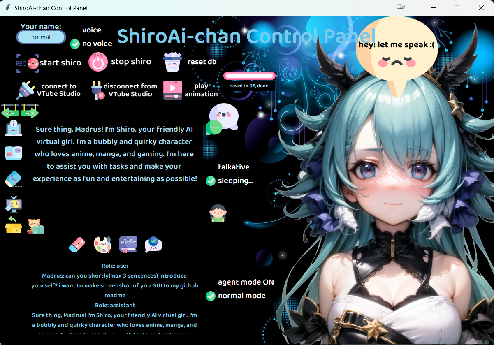

# 1. ShiroAi-chan and her friend Kiki-chan

### My attempt to create my anime waifu discord bot that can write and speak in cute voice.

### Description:
My personal Ai assistant ShiroAi-chan. I wanted to create AI girl from a long time and now with really cheap and powerful model like [ChatGPT API] it's possible for anyone.

### Her personality
* She is virtual cat-girl that likes anime, manga, light novels and games. (I wrote it for my preferences, but it can be changed easily). I am using tables as her 'personalities' for example, 'normal' is just her basic character description, but 'programmer' is her when she is in coding mode. Then she can help me with coding or I can just converse with her and she know what I am talking about.

### GUI

## Some steps that she uses
### 1. Writing
* She uses [ChatGPT API] to generate responses.

### 2. Her memory :heart_eyes:
* She uses MariaDB to store her memories. She can remember up to 4 last questions, more is too expensive using [ChatGPT API].
* Every 'persona' setting has its own table in database and can reset it with button.

### 3. Give her voice! :microphone:
*  Using Microsoft [Azure TTS], send API with generated prompts to get audio file.

### 4. Communicate with her :speech_balloon:
* I am using open source Whisper Model from OpenAI to transcribe audio from microphone to text.
* Also it's possible to just write in input and sent it to her.

### Instructions for me:

### But how will it look from back side?

#### To do but small steps:
* #### Voice:
  * I need to delete wav file after it's played because it's starting when I am starting [gradio].
* #### Look :star_struck:
  * I need to record some animations in [Vtube studio].
  * [to do next] And i will need to use some combination of Sentiment Analysis and key words combinations to get needed info to play appropriate animation. Azure or something.

## Links 

[ChatGPT API] : https://openai.com/blog/introducing-chatgpt-and-whisper-apis

[Azure TTS] : https://azure.microsoft.com/en-us/products/cognitive-services/text-to-speech/

[ChatGPT API]: https://openai.com/blog/introducing-chatgpt-and-whisper-apis
[Azure TTS]: https://azure.microsoft.com/en-us/products/cognitive-services/text-to-speech/

