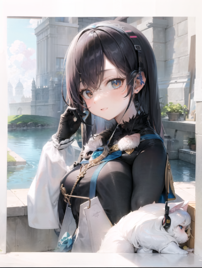

# 1. ShiroAi-chan and her friend Kiki-chan

### My attempt to create my anime waifu discord bot that can write and speak in cute voice.

### Description:
Discord bot, or as it is now duet of bots. ShiroAi-chan is a Virtual streamer on Twitch platform but now she is just chatting on Discord. She uses [ChatGPT API] as her brain and [Azure TTS] as her voice. Unfortunately I encountered a problem when I was working on her speech capabilities and I needed to use second bot to record questions on voice channel. Now ShiroAi-chan has a friend Kiki-chan that is kind of her interpreter.

### Her personality
* As for now she is Virtual streamer on Twitch platform that is off work and just chat on Discord with viewers. She is cat-girl and likes to answer with cat-style words. She is cheerful and likes joking.
  
## Some steps that she uses
### 1. Writing
* She uses [ChatGPT API] to generate responses.
* She has some slash commands to interact with her.

### 2. Her memory :heart_eyes:
* She uses [Azure SQL Database] to store her memories. She can remember up to 4 last questions, more is too expensive using [ChatGPT API].
* Every user has his own table in database and can reset it with command.

### 3. Give her voice! :microphone:
*  Using Microsoft [Azure TTS], send API with generated prompts to get audio file.

### Instructions for me:

### But how will it look from back side?

## Progress for now
* I got it to work with [gradio]. 
  * There is some manual procedure, need to start [koboldAI] and [gradio] via Power Shell and [Vtube studio] with plugin.
  * **BUT!** I can converse and see response in chat log and hear her voice while she looks at me  :blush: :smile:

#### To do but small steps:
* #### Voice:
  * I need to delete wav file after it's played because it's starting when I am starting [gradio].
* #### Look :star_struck:
  * I need to record some animations in [Vtube studio].
  * [to do next] And i will need to use some combination of Sentiment Analysis and key words combinations to get needed info to play appropriate animation. Azure or something.

## Links 

[ChatGPT API] : https://openai.com/blog/introducing-chatgpt-and-whisper-apis

[Azure SQL Database] : https://azure.microsoft.com/en-us/products/azure-sql/database

[Azure TTS] : https://azure.microsoft.com/en-us/products/cognitive-services/text-to-speech/

[Azure SQL Database]: https://azure.microsoft.com/en-us/products/azure-sql/database
[ChatGPT API]: https://openai.com/blog/introducing-chatgpt-and-whisper-apis
[Azure TTS]: https://azure.microsoft.com/en-us/products/cognitive-services/text-to-speech/

