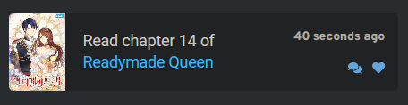
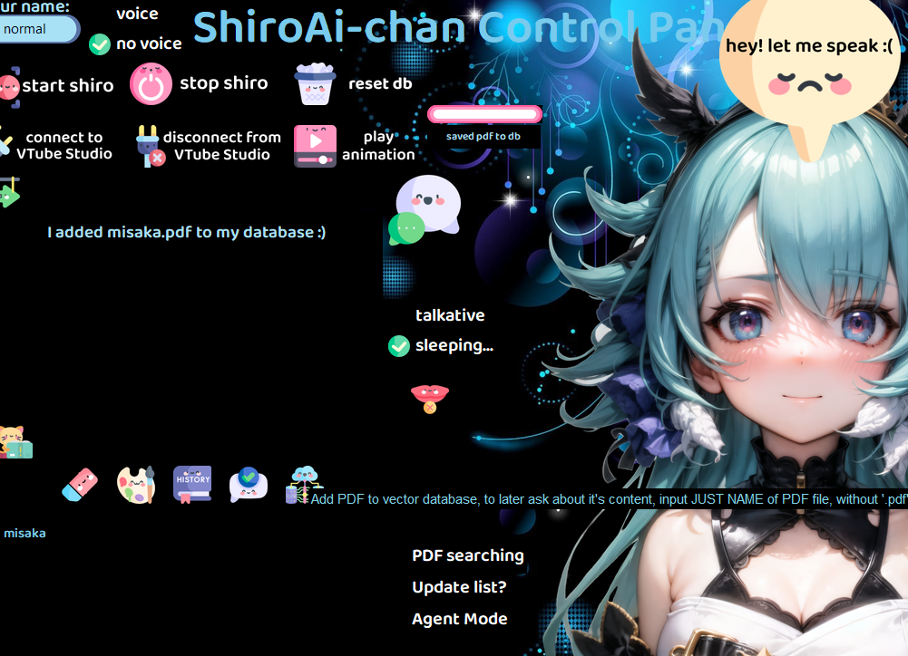

# 1. ShiroAi-chan , personal assistant powered by ChatGPT API

### Introducing My Anime Waifu Assistant: ShiroAi-chan
Harness the power of ChatGPT API to bring your very own AI-powered anime waifu to life! ShiroAi-chan is a customizable AI assistant designed to offer both written and vocal responses in an endearing manner.

### Her Personality 💖
ShiroAi-chan embodies the persona of a virtual cat-girl fond of anime, manga, light novels, and games. While her personality aligns with my interests, you can easily adapt her character to suit yours. Her dialogues are generated through prompts to the ChatGPT API, offering various 'personality modes' such as 'programmer god,' where she assists with coding queries.

### Platform-Specific Versions of ShiroAi-chan 🖥️📱⌚
1. [Streamlit repo] - The web version, built using [Streamlit].
2. [Desktop repo] - The desktop version featuring a Tkinter-based GUI.
3. [Wearos repo] - The mobile version, optimized for WearOS watches. This version runs on [FastAPI] inside a Docker container. (This version is most personalized, as I was focused on my Galaxy Watch 4)

- [Features](#Features)
- [Screenshots](#Screenshots)
- [Configuration](#Configuration)
- [GUI Icons](#GUIIcons)

## Features
### 1. Writing ✍️
* ShiroAi-chan utilizes the [ChatGPT API] to respond as an adorable AI cat-girl.

### 2. Her Memory 😍
* MariaDB stores her memories. She remembers the last 4 questions (configurable for more).
* She can also "read" PDFs stored in a Chroma Vector Database, using Huggingface Embeddings.
* Every 'persona' setting has its own table in database and can reset it with button.
  
  
### 3. Voice 🎤
*  Leveraging Microsoft Azure TTS, she can speak in both English and Polish. English is cuter.
*  You can skip her talking using button.

### 4. Communication 🗨️

* Type your query into the input field or use built-in TTS on mobile devices.
* Use OpenAI Whisper model, locally launched, to transcribe your voice from microphone to text.
  
### 5. AI Features 🤖 ( examples in screenshots)
  She employs a Langchain Agent to choose tools, which include:

  * Retrieving the last 10 anime/manga list entries from Anilist. (ask about it with agent mode checkbox ON or press button)
  * Updating anime/manga on last 10 anime/manga list, using human-like sentences. 
  * Vector database searches for document-based queries. You can add full pdf books, or other documents, and ask questions to this documents then she will take relevant parts from documents, and answer questions analyzing that parts.
  * Calendar functions to add and retrieve events. Add events based on what information you give her (in normal human sentence!) and retrieve information about events for specified days. (accuracy is like 85%, it's hard to have 100% if event is too detailed) This function is using Caldav, I am using nextcloud API for it.
  * Weather and home sensor data, along with quirky commentary. It's more my personal function, because you need to change code of home assistant API and have sensor in the first place.
  
To use tools, you can just start question with 'agent mode' or 'agent:' or check agent mode check.

### 6. Interactive Conversations 🗨️
* To keep the chat engaging, ShiroAi-chan features a 'Random Questions' radio button. When activated, she will ask questions based on the current conversation flow. If you don’t respond, she'll prompt you with questions like "Are you there?" or "Why didn't you answer me?" to keep the interaction alive.

### 7. Visuals & Animations 🎭
* ShiroAi-chan integrates with Vtube Studio to showcase a Live 2D avatar, making the conversation visually appealing. She can currently play animations at the press of a button. The work-in-progress aspect lies in analyzing the sentimentality of Shiro's responses to trigger animations that match the mood of her answers.
 

### 8. Shared Code 🔄
* The 'shared_code' folder contains code that is common across all versions of ShiroAi-chan.
  * link to repository: https://github.com/ShiroePL/shiro_shared_code

## Screenshots
#### Normal Talking Mode
* Talk to her just like you would with anyone else!

<table>
  <tr>
    <td><strong>Are you comfy?</strong>
       
      
    </td>
    <td><strong>Favorite juice?</strong>
       
      
    </td>
  </tr>
</table>

Anime/Manga List 📋
* See your latest watched/read anime/manga.

<table>
  <tr>
    <td>
       
      
    </td>
  </tr>
</table>

* Update list.

<table>
  <tr>
    <td>
       <strong>Here's list before update</strong>
      
    </td>
    <td><strong>Asking for update</strong>
      
       
      <strong>It worked, from Anilist site 😊</strong>  
      
    </td>
  </tr>
</table>

Calendar Functions 🗓️
<table>
  <tr>
    <td>
      <strong>Adding a New Event:</strong> 
      
    </td>
    <td>
      <strong>Retrieving Plans for a Specified Day:</strong> 
      
    </td>
  </tr>
</table>

Vector Database Functions 📚
<table>
  <tr>
    <td>
      <strong>Saving PDFs to Vector Database:</strong> 
      
    </td>
    <td>
      <strong>PDF Fragment:</strong> 
      
      <strong>Asking Questions Based on PDF Content:</strong> 
      
    </td>
  </tr>
</table>

Room Temperature 🌡️
* Check out the current temperature of your room.

## GUI Icons
### Quick description of GUI icon
<table border="0">
  <tr>
    <td align="center"> </td>
    <td align="center"></td>
    <td align="center"></td>
    <td align="center"> </td>
  </tr>
  <tr>
    <td align="center"> <b>Previous/next answer</b></td>
    <td align="center"> <b>Show current personality prompt</b></td>
    <td align="center"> <b>Show all personalities in table</b></td>
    <td align="center"> <b>Clear text box</b></td>
  </tr>
</table>

<table border="0" >
  <tr>
    <td align="center"></td>
    <td align="center"></td>
    <td align="center"></td>
    <td align="center"></td>
  </tr>
  <tr>
    <td align="center"> <b>Show 10 most recent anime entries from Anilist</b></td>
    <td align="center"> <b>Show room temperature  (home assistant)</b></td>
    <td align="center"> <b>Show 10 most recent manga entries from Anilist</b></td>
    <td align="center"> <b>Swap personality. Current one saves to table. </b></td>
  </tr>
</table>

<table border="0">
  <tr>
    <td align="center"></td>
    <td align="center"></td>
    <td align="center"></td>
    <td align="center"></td>
  </tr>
  <tr>
    <td align="center"> <b>View last 4 Q&A in history table.</b></td>
    <td align="center"> <b>Send input to Shiro!</b></td>
    <td align="center"> <b>Add PDF to vector database</b></td>
    <td align="center"> <b>Stop Shiro from speaking 😭</b></td>
  </tr>
</table>

## Configuration
### 8. Configuration and Installation 🛠️

## Links 

[ChatGPT API] : https://openai.com/blog/introducing-chatgpt-and-whisper-apis

[Azure TTS] : https://azure.microsoft.com/en-us/products/cognitive-services/text-to-speech/

[Streamlit] : https://streamlit.io/

[ChatGPT API]: https://openai.com/blog/introducing-chatgpt-and-whisper-apis
[Azure TTS]: https://azure.microsoft.com/en-us/products/cognitive-services/text-to-speech/
[Streamlit]: https://streamlit.io/